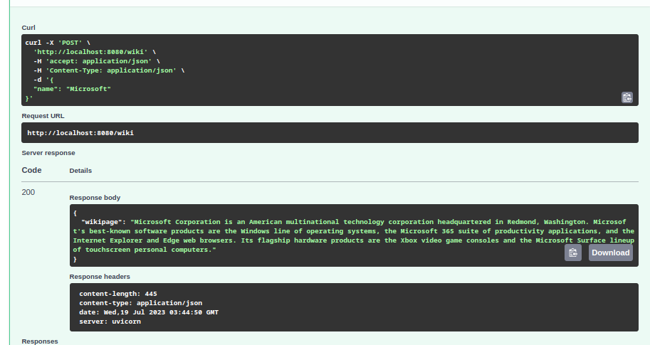

[](https://github.com/arnold1108/wikibot/actions/workflows/main.yml)
# Wikibot
# Wikipedia Scraper
This project is a simple program that allows you to scrape the first few sentences of a Wikipedia page using Python. It utilizes the `wikipedia` library and provides a command-line interface for easy interaction.

## Features
* Retrieve the contents of a Wikipedia page by providing a topic and desired number of sentences.
* Utilize the `wikipedia` library to fetch data from Wikipedia
* Customize the number of sentences to retrieve through command-line options 
* use FastAPI to create a web application with API endpoints
* Implement POST endpoints for scraping Wikipedia pages based on a given name
* Utilize the `scrape` function from the mylib.bot module to fetch Wikipedia contents
* Return the scraped content in JSON format using the `JSONResponse` class from `fastapi.responses`


## Getting started 
clone the repository:

`git clone https://github.com/arnold1108/wikibot.git`

Install dependencies:

Before installing, I would recommend that you activate the virtual environment:

`source .env/bin/activate`

Then use the `Makefile` to install:

`make install`

Alternatively, you can use the `requirements.txt` file to install the dependencies:

`pip install -r requirements.txt`

## Usage
To run the Wikipedia Scraper, use the following command:

`python wikibot.py --topic "Topic name" --sentences 3`

You can get an info by running the following command:

`python wikibot.py --help`

Example:

`python wikibot.py --topic "Microsoft" --sentences
 2`

The output would look like:

`Microsoft Corporation is an American multinational technology corporation headquartered in Redmond, Wa
shington. Microsoft's best-known software products are the Windows line of operating systems, the Micr
osoft 365 suite of productivity applications, and the Internet Explorer and Edge web browsers.
`
### Using the FastAPI application:

Start the FastAPI application: 

`python main.py`

Open your browser and go to `http://localhost:8080` to access the root endpoint 

To check the documentation, visit the `Swagger` docs page using the `http://localhost:8080/docs` from where you can use the `POST` and `GET` endpoints via the UI.

To try it our, go to the POST api and try it out. Change the request body to have the name of the content you want to scrape, so that it looks like:

`{
  "name": "Microsoft"
}`

Replace Microsoft with any other Wikipedia Topic and click execute to get the server response. You should get a `Response body` and a `Response headers`:



You can also call the microservice APU using the curl. You have to do something like this:

```bash
curl -X 'POST' \
  'http://localhost:8080/wiki' \
  -H 'accept: application/json' \
  -H 'Content-Type: application/json' \
  -d '{
  "name": "Microsoft"
}'```


## Packaging and Containerization
Use the `docker build .` command to package it into a docker image

To check the image list, use `docker image ls` to confirm that the image has been built

Run `docker run -p 127.0.0.1:8080:8080 <image>` to spin up your container 

